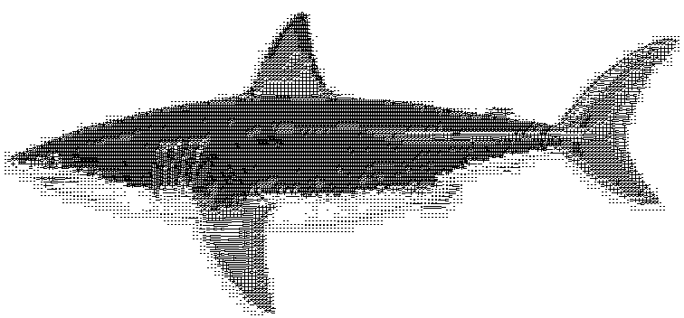

# MonoShark

MonoShark is a Python tool for converting images into jumbled overlapping text in "The Raw Shark Texts" style.

## Features

- Converts input images to jumbled overlapping text.
- Uses "The Raw Shark Texts" style for a unique output.

## Installation

Use the following command to install the required dependencies:

```bash
make init
```

## Usage

Run the following command to convert images:

```bash
make run
```

## Configuration

Configuration settings can be adjusted in the `config.ini` file.

## Example Output



## Documentation

To build documentation, run:

```bash
make doc
```

To view documentation, run:

```bash
make serve
```

## License

This project is licensed under the [MIT License](LICENSE).